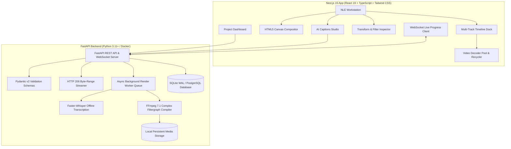

# 🎬 Cloud-Native Non-Linear Video Editor (NLE) & AI Captions Studio

<div align="center">

[](https://video-editor-two-beta.vercel.app/)
[](https://video-editor-backend-uqxp.onrender.com/api/health)
[](https://video-editor-backend-uqxp.onrender.com/docs)
[](https://opensource.org/licenses/MIT)

[](https://nextjs.org/)
[](https://fastapi.tiangolo.com/)
[](https://python.org)
[](https://ffmpeg.org/)
[](https://github.com/SYSTRAN/faster-whisper)
[](https://tailwindcss.com/)

**A complete, browser-based Non-Linear Video Editor (NLE) and AI Captions Studio running entirely on local or self-hosted cloud infrastructure with ZERO external third-party API dependencies.**

[🌐 Launch Live Studio](https://video-editor-two-beta.vercel.app/) • [📖 API Documentation](https://video-editor-backend-uqxp.onrender.com/docs) • [🚀 Free Deployment Guide](FREE_DEPLOYMENT_GUIDE.md)

</div>

---

## 🌟 Key Features

### 🎞️ 1. Multi-Track NLE Timeline Dock
- **Multi-Track Stacking:** Dedicated tracks for Video (`V1`, `V2`...), Audio (`A1`, `A2`...), and Titles/Captions (`T1`, `T2`...).
- **Frame-Accurate Razor Tool:** Split clips instantly at the playhead position using keyboard shortcuts (`C` or `S`).
- **Precision Trimming:** Trimmable in/out handles, ripple edit toggle, and magnetic grid snapping.
- **Track Controls:** Track Mute, Solo (`S`), Lock, Hide, and individual track volume gain sliders.
- **Dynamic Ruler:** Zoomable timecode ruler rendering in seconds, frames, and SMPTE timecodes (`HH:MM:SS:FF`).
- **Undo / Redo History:** Immutable 30-step state history stack (`Ctrl+Z` / `Ctrl+Y`) powered by Zustand + Immer.

### 🎨 2. High-Performance Canvas & WebGL Compositor
- **Interactive Viewport:** Real-time multi-layer video compositor with on-canvas bounding box controls for visual drag-repositioning, scaling, and rotation.
- **Aspect Ratio Presets:** 1-click toggling between **16:9 Landscape** (YouTube/TV), **9:16 Vertical** (TikTok/Reels/Shorts), **1:1 Square** (Instagram), and **21:9 Ultrawide**.
- **Safe Area Guides:** Action Safe (90%), Title Safe (80%), and center alignment crosshairs.
- **Color Grading & Filters:** Live CSS/Canvas filter processing (Brightness, Contrast, Saturation, Hue Rotation, Blur, Sepia, Grayscale, Invert).
- **Speed Ramping:** Variable clip playback rates (0.25x to 4.0x) with pitch-corrected audio synchronization.

### 🎙️ 3. Offline AI Captions & Subtitle Studio
- **100% Offline Speech-to-Text:** Local `Faster-Whisper` AI engine transcribes speech with word-level timestamps without sending data to external APIs.
- **Viral Styling Templates:**
  - 🟡 **Viral TikTok / MrBeast Gold:** High-impact yellow text with heavy black stroke and dynamic box highlight.
  - ⚪ **Clean Minimalist White:** Crisp modern typography with subtle drop shadow.
  - 🟢 **Cyber Neon:** High-contrast neon green with dark outline.
  - 🔲 **Cinematic Boxed:** Translucent rounded pill background with clean white typography.
  - 🔴 **Punchy Red:** High-energy white font with vibrant red outline.
- **Interactive Subtitle Editor:** Edit text, adjust start/end timestamps, click to seek playhead, and add/split segments.
- **1-Click Apply to Timeline:** Converts all caption segments directly into animated subtitle clips on the timeline text track.
- **SRT / VTT Support:** Import and export industry-standard `.srt` and `.vtt` subtitle files.

### 🚀 4. Self-Contained FFmpeg 7.1 Processing Core
- **Fast Proxy Transcoding:** Automatically creates 720p/360p H.264 proxies with `+faststart` for zero-lag browser scrubbing.
- **Peak Audio Waveforms:** Normalized 150-bucket audio amplitude extractor for timeline visual waveform rendering.
- **HTTP 206 Byte-Range Streaming:** Custom range streamer (`Range: bytes=start-end`) for instant HTML5 `<video>` scrubbing.
- **Filtergraph Compiler:** Compiles multi-track timeline JSON into dynamic `-filter_complex` FFmpeg commands with bundled fonts, opacity blending, transforms, color grading, transitions, and audio mixing.
- **Live WebSocket Progress:** Real-time 0–100% frame-by-frame progress streaming to connected clients.

---

## 🏗️ System Architecture



---

## ⌨️ Keyboard Shortcuts

| Shortcut | Action |
|---|---|
| `Space` | Play / Pause playback |
| `S` or `C` | Razor Split clip at current playhead position |
| `V` | Switch to Selection Tool |
| `Delete` / `Backspace` | Delete selected clip(s) |
| `Home` | Rewind playhead to start (`0:00.0`) |
| `Left Arrow` / `Right Arrow` | Step backward / forward 1 frame |
| `Shift + Left / Right Arrow` | Step backward / forward 1.0 second |
| `Ctrl + Z` | Undo timeline action |
| `Ctrl + Y` | Redo timeline action |
| `Ctrl + S` | Save project state to backend |

---

## 🚀 Quickstart & Local Installation

### Prerequisites
- [Node.js 18+](https://nodejs.org/)
- [Python 3.11+](https://python.org)
- [FFmpeg](https://ffmpeg.org/) *(auto-downloaded via `imageio-ffmpeg` if not installed)*

### Windows:
Double-click `run_dev.bat` or execute:
```powershell
.\start_dev.ps1
```

### macOS / Linux:
```bash
chmod +x start_dev.sh
./start_dev.sh
```

### Manual Setup:
1. **Start Backend:**
   ```bash
   cd backend
   pip install -r requirements.txt
   python -m uvicorn app.main:app --reload --port 8000
   ```
2. **Start Frontend:**
   ```bash
   cd frontend
   npm install
   npm run dev
   ```
3. Open **`http://localhost:3000`** in your browser.

---

## 🐳 Docker & Cloud Deployment

### Local Docker Compose:
```bash
docker compose up --build
```
- Frontend: `http://localhost:3000`
- Backend API: `http://localhost:8000/api`
- Swagger Docs: `http://localhost:8000/docs`

### 100% Free Production Deployment (Render + Vercel):
Detailed step-by-step instructions for deploying free on Render and Vercel are available in **[FREE_DEPLOYMENT_GUIDE.md](FREE_DEPLOYMENT_GUIDE.md)**.

### 1-Click Cloud VPS Deployment (Ubuntu / Debian / AWS / DigitalOcean):
```bash
git clone https://github.com/ShreyasVavley/Video-Editor.git
cd Video-Editor
chmod +x deploy.sh
./deploy.sh
```

---

## 🗄️ Relational Database Schema

```sql
-- Users
CREATE TABLE users (
    id VARCHAR(36) PRIMARY KEY,
    email VARCHAR(255) UNIQUE NOT NULL,
    hashed_password VARCHAR(255) NOT NULL,
    created_at TIMESTAMP WITH TIME ZONE DEFAULT CURRENT_TIMESTAMP
);

-- Projects
CREATE TABLE projects (
    id VARCHAR(36) PRIMARY KEY,
    user_id VARCHAR(36) REFERENCES users(id) ON DELETE CASCADE,
    title VARCHAR(255) NOT NULL DEFAULT 'Untitled Project',
    width INT NOT NULL DEFAULT 1920,
    height INT NOT NULL DEFAULT 1080,
    fps INT NOT NULL DEFAULT 30,
    duration_seconds FLOAT NOT NULL DEFAULT 0.0,
    thumbnail_url VARCHAR(512),
    timeline_state JSON NOT NULL DEFAULT '{}',
    created_at TIMESTAMP WITH TIME ZONE DEFAULT CURRENT_TIMESTAMP,
    updated_at TIMESTAMP WITH TIME ZONE DEFAULT CURRENT_TIMESTAMP
);

-- Media Assets
CREATE TABLE assets (
    id VARCHAR(36) PRIMARY KEY,
    project_id VARCHAR(36) REFERENCES projects(id) ON DELETE CASCADE,
    user_id VARCHAR(36) REFERENCES users(id) ON DELETE CASCADE,
    file_name VARCHAR(255) NOT NULL,
    file_path VARCHAR(512) NOT NULL,
    proxy_path VARCHAR(512),
    mime_type VARCHAR(100) NOT NULL,
    file_size_bytes BIGINT NOT NULL,
    duration_seconds FLOAT DEFAULT 0.0,
    width INT,
    height INT,
    fps FLOAT,
    audio_waveform JSON,
    created_at TIMESTAMP WITH TIME ZONE DEFAULT CURRENT_TIMESTAMP
);

-- Render & Export Jobs
CREATE TABLE render_jobs (
    id VARCHAR(36) PRIMARY KEY,
    project_id VARCHAR(36) REFERENCES projects(id) ON DELETE CASCADE,
    status VARCHAR(50) NOT NULL DEFAULT 'QUEUED',
    progress_percentage INT DEFAULT 0,
    output_resolution VARCHAR(50) DEFAULT '1080p',
    output_file_path VARCHAR(512),
    error_log TEXT,
    created_at TIMESTAMP WITH TIME ZONE DEFAULT CURRENT_TIMESTAMP,
    completed_at TIMESTAMP WITH TIME ZONE
);
```

---

## 🤝 Authors & Contributors

- **[Shreyas Vavley](https://github.com/ShreyasVavley)** - Architecture, Full-Stack Platform, Timeline Engine & Deployment
- **[Shreyas BR](https://github.com/ShreyasBR21)** - Multimedia Engineering, Captions System & Optimization

---

## 📄 License

This project is open-source and licensed under the [MIT License](LICENSE).
